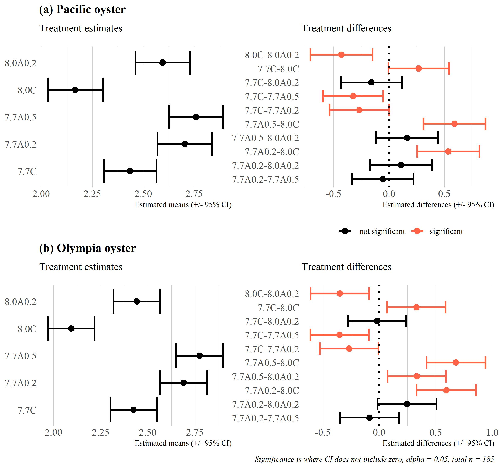
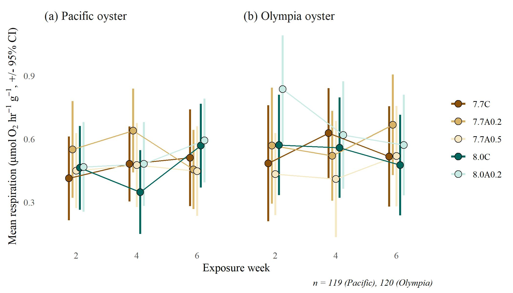

```{r message = F, warning = F, results = 'hide', echo = T}
knitr::opts_chunk$set(echo = TRUE, warning = F, message = F, fig.path = 'figs/')

library(tidyverse)
library(patchwork)
library(psycho)
library(lmerTest)
library(hrbrthemes)
library(janitor)
library(survival)
library(modelbased)
library(readxl)
library(ggfortify)

trts <- tibble(
  shrtlab = c("8.0C", "8.0A0.2", "7.7C", "7.7A0.2", "7.7A0.5"),
  lngslab = c("8.0 Constant", "8.0 Fluctuating 0.2A", "7.7 Constant", "7.7 Fluctuating 0.2A", "7.7 Fluctuating 0.5A")
)
```

# Figures {.tabset}

## Survival estimates, between treatments

[download](figs/survivaltreat.jpg)
```{r, results = 'hide'}
srvraw <- read.csv(here::here('data/raw/Weight_with dead but not multiple_Kelp_4_3.csv'), stringsAsFactors = F) %>% 
  clean_names() %>% 
  filter(species != '') %>% 
  mutate(species = gsub('\\s*$', '', species)) %>% 
  rename(
    id = individual_id, 
    jar = i_jar,
    trt = treatment
  ) %>% 
  select(week, trt, jar, id, species, dead) %>% 
  mutate(
    dead = case_when(
      dead %in% c('x', 'X') ~ 1, 
      T ~ 0
    ), 
    trt = factor(trt, levels = trts$shrtlab)
  )
  
srvdat <- srvraw %>% 
  group_by(species) %>%
  nest %>% 
  mutate(
    srvmod = purrr::map(data, function(x){

      fit <- survfit(Surv(week, dead) ~ trt, data = x)
      return(fit)
      
    }), 
    srvdif = purrr::map(data, function(x){
    
      fit <- survdiff(Surv(week, dead) ~ trt, data = x)
      return(fit)
      
    })
  )

srvplos <- srvdat %>% 
  mutate(
    plodat = purrr::map(srvmod, fortify)
  ) %>% 
  select(-data, -srvmod, -srvdif) %>% 
  unnest(plodat)

cols <- c('seagreen4', 'seagreen2', 'khaki4', 'khaki3', 'khaki1')
names(cols) <- trts$shrtlab

p <- ggplot(srvplos, aes(x = time, y = surv)) + 
  geom_line(aes(colour = strata), size = 1.5) + 
  geom_ribbon(aes(ymin = lower, ymax = upper), colour = NA, fill = 'lightgrey', alpha = 0.25) +
  facet_grid(species ~ strata) +
  scale_colour_manual('Treatment', values = cols, guide = F) +
  theme_minimal() +
  theme(
    panel.grid.major.x = element_blank(), 
    panel.grid.minor.x = element_blank(), 
    legend.position = 'top'
  ) + 
  labs(
    x = 'Week', 
    y = '% survival', 
    title = 'Survival estimates by treatment and species',
    subtitle = 'Shaded region is 95% CI'
  )

jpeg('figs/survivaltreat.jpg', height = 5, width = 7, units = 'in', res = 300, family = 'serif')
p
dev.off()
```

```{r survivaltreat, fig.cap = "Survival estimates of oysters by species and treatment from the beginning to end of the six week exposure period.  Values are the approximate percentage of individuals surviving at each time step and are based on Kaplan-Meier estimates for right-censored data.", out.width = "70%", fig.align = 'center'}
knitr::include_graphics('figs/survivaltreat.jpg')
```

## Dissolution models - week by trt

[download](figs/dissmod1.jpg)
```{r, results = 'hide'}

# dissolution data
dissdat <- read.csv('data/raw/SEM scoring datasheet_MRVERSION.csv') %>% 
  clean_names() %>% 
  filter(week != 0) %>% 
  select(
    jar, 
    id = individual_id, 
    species, 
    week, 
    trt = treatment,
    rep, 
    scr = dissolution_score1
  ) %>% 
  group_by(jar, id, species, week, trt) %>% 
  summarise(
    val = mean(scr, na.rm = T),
    .groups = 'drop'
    ) %>% 
  mutate(
    jar = factor(jar),
    trt = factor(trt, levels = c("7.7C", "7.7A0.2", "7.7A0.5", "8.0C", "8.0A0.2"))
  )

# treatment colors
cls <- RColorBrewer::brewer.pal(6, 'BrBG')
cls <- c(cls[1:3], cls[c(6, 4)])
names(cls) <- levels(dissdat$trt)

# all comparisons
dissmodsall <- dissdat %>%
  group_by(species) %>% 
  nest %>% 
  mutate(
    mixmod = purrr::map(data, function(x){

      tomod <- x %>% 
        mutate(
          week = factor(week), 
          jar = fct_drop(jar), 
          trt = fct_drop(trt)
        )
      
      out <- lmerTest::lmer(val ~ trt * week + (1|jar), data = tomod)
      
      return(out)
      
    })
  )

# sample size
pacn <- dissmodsall %>% filter(species == 'Pacific') %>% pull(mixmod) %>% .[[1]] %>% .@frame %>% nrow
olyn <- dissmodsall %>% filter(species == 'Olympia') %>% pull(mixmod) %>% .[[1]] %>% .@frame %>% nrow
captns <- paste0('n = ', pacn , ' (Pacific), ', olyn, ' (Olympia)')

# Pacific estimates
mnsval <- dissmodsall %>% 
  select(species, mixmod) %>% 
  mutate(
    mixmod = purrr::map(mixmod, estimate_means)
    ) %>% 
  unnest('mixmod') %>% 
  mutate(
    species = factor(species, levels = c('Pacific', 'Olympia'), labels = c('(a) Pacific oyster', '(b) Olympia oyster'))
  )

# mean estimate plots
p <- ggplot(mnsval, aes(x = week, y = Mean, group = trt, colour = trt, fill = trt)) + 
  geom_errorbar(aes(ymin = CI_low, ymax = CI_high, colour = trt), width = 0, position = position_dodge(0.3), size = 1) + 
  geom_line(position = position_dodge(0.3)) + 
  geom_point(size = 3, position = position_dodge(0.3), pch = 21, colour = 'black') + 
  labs(x = 'Exposure week', y = 'Mean dissolution (+/- 95% CI)', caption = captns) + 
  facet_wrap(~species, ncol = 2) +
  scale_colour_manual(values = cls) + 
  scale_fill_manual(values = cls) + 
  theme_minimal() + 
  theme(
    panel.grid.major = element_blank(),
    panel.grid.minor = element_blank(), 
    legend.title = element_blank(), 
    strip.text = element_text(hjust = 0, size = 12), 
    plot.caption = element_text(face = 'italic')
  )

jpeg('figs/dissmod1.jpg', height = 4, width = 7, units = 'in', res = 300, family = 'serif')
p
dev.off()
```
```{r dissmod1, fig.cap = "Model estimates of mean dissolution (+/- 95% confidence intervals) for each species, treatment and week of experimental exposure.  Estimates are based on two-way analysis of variance models with an interaction between week and treatment, using jar as a random effect.  Confidence intervals that do not include zero have statistically significant dissolution and treatments/weeks that have non-overlapping confidence intervals can be considered statistically different.  Dissolution is expressed as a relative total from 0-1 based on descriptions in the methods.", out.width = "90%", fig.align = 'center'}

```

## Distribution of model residuals

[download](figs/dissmod1resid.jpg)
```{r, results = 'hide'}
toplo <- dissmodsall %>% 
  mutate(
    resid = purrr::map(mixmod, residuals)
  ) %>% 
  select(species, resid) %>% 
  unnest('resid')

p <- ggplot(toplo, aes(sample = resid)) + 
  stat_qq() + 
  stat_qq_line() +
  facet_wrap(~species, ncol = 2) +
  labs(
    x = 'Theoretical quantiles', 
    y = 'Sample quantiles'
  ) +
  theme(
    strip.background = element_blank()
  ) + 
  theme_minimal()

jpeg('figs/dissmod1resid.jpg', height = 3, width = 5, units = 'in', res = 300, family = 'serif')
p
dev.off()
```

```{r dissmod1resid, fig.cap = "Distribution of model residuals (sample) vs theoretical quantiles from a normal distribution. Model residuals are based on mean dissolution for each species vs treatment and week of experimental exposure.  Estimates are based on two-way analysis of variance models with an interaction between week and treatment, using jar as a random effect.", out.width = "70%", fig.align = 'center'}
knitr::include_graphics('figs/dissmod1resid.jpg')
```

## Dissolution models - trt only

[download](figs/dissmod2.jpg)
```{r, results = 'hide'}

# fit separate dissolution mixed models by species, week not tested
dissbymods <- dissdat %>%
  group_by(species) %>% 
  nest %>% 
  mutate(
    mixmod = pmap(list(data), function(data){
      
      tomod <- data %>%
        mutate(
          trt = fct_drop(trt),
          jar = fct_drop(jar)
        )

      out <- lmerTest::lmer(val ~ trt + (1|jar), data = tomod)
      
      return(out)
      
    }),
    anomod = map(mixmod, function(x){
    
      out <- anova(x)
      
      return(out)
      
    })
  )

mrg <- 0

##
# Pacific oyster plots

species <- 'Pacific'
mixmod <- dissmodsall %>% 
  filter(species == !!species) %>% 
  pull(mixmod) %>% 
  .[[1]]

# estimates
mnsval <- estimate_means(mixmod, 'trt')
cnsval <- estimate_contrasts(mixmod, 'trt') %>% 
  mutate(
    sig = ifelse(p < 0.05, 'sig', 'notsig'),
    sig = factor(sig,levels = c('notsig', 'sig'), labels = c(' not significant', 'significant'))
  ) %>% 
  unite('Contrast', Level1, Level2, sep = '-')

# sample size
n <- mixmod@frame %>% nrow

# labels
ttl <- paste0('(a) ', species, ' oyster')
captns <- paste0('Significance is where CI does not include zero, alpha = 0.05, total n = ', n)

# mean esimate plots
p1a <- ggplot(mnsval, aes(x = trt, y = Mean)) + 
  geom_point(size = 3) + 
  geom_errorbar(aes(ymin = CI_low, ymax = CI_high), colour = 'black', size = 1) + 
  labs(x = NULL, y = 'Estimated means (+/- 95% CI)', subtitle = 'Treatment estimates', title = ttl) + 
  theme_ipsum(
    plot_title_size = 14,
    plot_margin = margin(rep(mrg, 4)),
    base_family = 'serif'
  ) + 
  theme(
    panel.grid.major.y = element_blank(),
    panel.grid.minor.y = element_blank()
  ) + 
  coord_flip()

# contrast plots
p2a <- ggplot(cnsval, aes(x = Contrast, y = Difference, colour = sig)) + 
  geom_point(aes(colour = sig), size = 3) + 
  geom_errorbar(aes(ymin = CI_low, ymax = CI_high, colour = sig), size = 1) + 
  labs(x = NULL, y = 'Estimated differences (+/- 95% CI)', subtitle = 'Treatment differences') +
  theme_ipsum(
    plot_title_size = 14,
    plot_margin = margin(rep(mrg, 4)),
    base_family = 'serif'
  ) + 
  theme(
    legend.title = element_blank(), 
    legend.position = 'bottom', 
    panel.grid.major.y = element_blank(),
    panel.grid.minor.y = element_blank()
  ) +
  geom_hline(yintercept = 0, linetype = 'dotted', size = 1) + 
  scale_colour_manual(drop = F, values = c('black', 'tomato1')) + 
  coord_flip()

## 
# Olympic oyster plots

species <- 'Olympia'
mixmod <- dissmodsall %>% 
  filter(species == !!species) %>% 
  pull(mixmod) %>% 
  .[[1]]

# estimates
mnsval <- estimate_means(mixmod, 'trt')
cnsval <- estimate_contrasts(mixmod, 'trt') %>% 
  mutate(
    sig = ifelse(p < 0.05, 'sig', 'notsig'),
    sig = factor(sig,levels = c('notsig', 'sig'), labels = c(' not significant', 'significant'))
  ) %>% 
  unite('Contrast', Level1, Level2, sep = '-')

# sample size
n <- mixmod@frame %>% nrow

# labels
ttl <- paste0('(b) ', species, ' oyster')
captns <- paste0('Significance is where CI does not include zero, alpha = 0.05, total n = ', n)

# mean esimate plots
p1b <- ggplot(mnsval, aes(x = trt, y = Mean)) + 
  geom_point(size = 3) + 
  geom_errorbar(aes(ymin = CI_low, ymax = CI_high), colour = 'black', size = 1) + 
  labs(x = NULL, y = 'Estimated means (+/- 95% CI)', subtitle = 'Treatment estimates', title = ttl) + 
  theme_ipsum(
    plot_title_size = 14,
    plot_margin = margin(rep(mrg, 4)),
    base_family = 'serif'
    ) + 
  theme(
    panel.grid.major.y = element_blank(),
    panel.grid.minor.y = element_blank()
  ) + 
  coord_flip()

# contrast plots
p2b <- ggplot(cnsval, aes(x = Contrast, y = Difference, colour = sig)) + 
  geom_point(aes(colour = sig), size = 3) + 
  geom_errorbar(aes(ymin = CI_low, ymax = CI_high, colour = sig), size = 1) + 
  labs(x = NULL, y = 'Estimated differences (+/- 95% CI)', subtitle = 'Treatment differences',
       caption = captns) +
  theme_ipsum(
    plot_title_size = 14,
    plot_margin = margin(rep(mrg, 4)),
    base_family = 'serif'
  ) + 
  theme(
    legend.title = element_blank(), 
    legend.position = 'none', 
    panel.grid.major.y = element_blank(),
    panel.grid.minor.y = element_blank()
  ) +
  geom_hline(yintercept = 0, linetype = 'dotted', size = 1) + 
  scale_colour_manual(drop = F, values = c('black', 'tomato1')) + 
  coord_flip()

# final plot
p <- p1a + p2a + p1b + p2b + plot_layout(ncol  = 2)   
  
jpeg('figs/dissmod2.jpg', height = 7.5, width = 8, units = 'in', res = 300, family = 'serif')
p
dev.off()    
```
```{r dissmod2, fig.cap = "Model estimates of mean dissolution (+/- 95% confidence intervals) by treatment for (a) Pacific and (b) Olympia oysters.  Exposure week was not included as a model predictor becuase it was not significant in earlier models. Estimates are based on linear mixed effects models to test for differences in dissolution by treatment, using jar as a random effect. The left plots show mean dissolution estimates from each model and the right plots show post-hoc pairwise comparisons of mean differences between treatments.  Confidence intervals in the right plot that do not include zero indicate pairs of treatments with significantly different dissolution means. Dissolution is expressed as a relative total from 0-1 based on descriptions in the methods.", out.width = "80%", fig.align = 'center'}

```

## Calcification models - week by trt

[download](figs/calcmod1.jpg)
```{r, results = 'hide'}

calcdat <- read_excel('data/raw/Prism_average (3).xlsx') %>% 
  clean_names() %>% 
  filter(week != 0) %>% 
  select(
    species, 
    week, 
    trt = treatment,
    val = avg_prisms
  ) %>%
  mutate(
    trt = factor(trt, levels = c("7.7C", "7.7A0.2", "7.7A0.5", "8.0C", "8.0A0.2"))
  )

# all comparisons
calcmodsall <- calcdat %>%
  group_by(species) %>% 
  nest %>% 
  mutate(
    mixmodnoint = purrr::map(data, function(x){
      
      tomod <- x %>% 
        mutate(
          week = factor(week), 
          trt = fct_drop(trt)
        )
      
      out <- lm(val ~ trt + week, data = tomod)
      
      return(out)
      
    })
  )

# sample size
pacn <- calcmodsall %>% filter(species == 'Pacific') %>% pull(mixmodnoint) %>% .[[1]] %>% model.frame %>% nrow
olyn <- calcmodsall %>% filter(species == 'Olympia') %>% pull(mixmodnoint) %>% .[[1]] %>% model.frame %>% nrow
captns <- paste0('n = ', pacn , ' (Pacific), ', olyn, ' (Olympia)')

# Pacific estimates
mnsval <- calcmodsall %>% 
  select(species, mixmodnoint) %>% 
  mutate(
    mixmodnoint = purrr::map(mixmodnoint, estimate_means)
    ) %>% 
  unnest('mixmodnoint') %>% 
  mutate(
    species = factor(species, levels = c('Pacific', 'Olympia'), labels = c('(a) Pacific oyster', '(b) Olympia oyster'))
  )

# mean estimate plots
p <- ggplot(mnsval, aes(x = week, y = Mean, group = trt, colour = trt, fill = trt)) + 
  geom_errorbar(aes(ymin = CI_low, ymax = CI_high, colour = trt), width = 0, position = position_dodge(0.3), size = 1) + 
  geom_line(position = position_dodge(0.3)) + 
  geom_point(size = 3, position = position_dodge(0.3), pch = 21, colour = 'black') + 
  labs(x = 'Exposure week', y = 'Mean calcification (%, +/- 95% CI)', caption = captns) + 
  facet_wrap(~species, ncol = 2) +
  scale_colour_manual(values = cls) + 
  scale_fill_manual(values = cls) + 
  theme_minimal() + 
  theme(
    panel.grid.major = element_blank(),
    panel.grid.minor = element_blank(), 
    legend.title = element_blank(), 
    strip.text = element_text(hjust = 0, size = 12), 
    plot.caption = element_text(face = 'italic')
  )

jpeg('figs/calcmod1.jpg', height = 4, width = 7, units = 'in', res = 300, family = 'serif')
p
dev.off()
```
```{r calcmod1, fig.cap = "Model estimates of mean calcification (+/- 95% confidence intervals) for each species, treatment and week of experimental exposure.  Estimates are based on two-way analysis of variance model with fixed effects for week and treatment.  Confidence intervals that do not include zero have statistically significant calcification and treatments/weeks that have non-overlapping confidence intervals can be considered statistically different.", out.width = "90%", fig.align = 'center'}
knitr::include_graphics('figs/calcmod1.jpg')
```

## Respiration models - week by trt

[download](figs/respmod1.jpg)
```{r, results = 'hide'}

trts <- tibble(
  shrtlab = c("7.7C", "7.7A0.2", "7.7A0.5", "8.0C", "8.0A0.2"),
  lngslab = c("pH7.7", "pH7.7A0.2", "pH7.7A0.5", "pH8.0", "pH8.0A0.2")
)

respdat <- read_excel('data/raw/Resp and CR data (1).xlsx', sheet = 'Respiration Rates') %>% 
  clean_names() %>% 
  # filter(time != 0) %>% 
  select(
    species, 
    week, 
    trt = treatment,
    val = respiration_rate_umol_hr
  ) %>%
  mutate(
    val = as.numeric(val),
    trt = gsub('^8\\s\\.', '8.', trt),
    trt = factor(trt, levels = trts$lngslab, labels = trts$shrtlab), 
    trt = fct_drop(trt)
  ) %>% 
  filter(!is.na(species))

# treatment colors
cls <- RColorBrewer::brewer.pal(6, 'BrBG')
cls <- c(cls[1:3], cls[c(6, 4)])
names(cls) <- levels(respdat$trt)

# all comparisons
respdatmodsall <- respdat %>%
  group_by(species) %>% 
  nest %>% 
  mutate(
    mixmod = purrr::map(data, function(x){
      
      tomod <- x %>% 
        mutate(
          week = factor(week), 
          trt = fct_drop(trt)
        )
      
      out <- lm(val ~ trt * week, data = tomod)
      
      return(out)
      
    })
  )

# sample size
pacn <- respdatmodsall %>% filter(species == 'Pacific') %>% pull(mixmod) %>% .[[1]] %>% model.frame %>% nrow
olyn <- respdatmodsall %>% filter(species == 'Olympia') %>% pull(mixmod) %>% .[[1]] %>% model.frame %>% nrow
captns <- paste0('n = ', pacn , ' (Pacific), ', olyn, ' (Olympia)')

# Pacific estimates
mnsval <- respdatmodsall %>% 
  select(species, mixmod) %>% 
  mutate(
    mixmod = purrr::map(mixmod, estimate_means)
    ) %>% 
  unnest('mixmod') %>% 
  mutate(
    species = factor(species, levels = c('Pacific', 'Olympia'), labels = c('(a) Pacific oyster', '(b) Olympia oyster'))
  )

# mean estimate plots
p <- ggplot(mnsval, aes(x = week, y = Mean, group = trt, colour = trt, fill = trt)) + 
  geom_errorbar(aes(ymin = CI_low, ymax = CI_high, colour = trt), width = 0, position = position_dodge(0.3), size = 1) + 
  geom_line(position = position_dodge(0.3)) + 
  geom_point(size = 3, position = position_dodge(0.3), pch = 21, colour = 'black') + 
  labs(x = 'Exposure week', y = 'Mean respiration (umol/hr, +/- 95% CI)', caption = captns) + 
  facet_wrap(~species, ncol = 2) +
  scale_colour_manual(values = cls) + 
  scale_fill_manual(values = cls) + 
  theme_minimal() + 
  theme(
    panel.grid.major = element_blank(),
    panel.grid.minor = element_blank(), 
    legend.title = element_blank(), 
    strip.text = element_text(hjust = 0, size = 12), 
    plot.caption = element_text(face = 'italic')
  )

jpeg('figs/respmod1.jpg', height = 4, width = 7, units = 'in', res = 300, family = 'serif')
p
dev.off()
```
```{r respmod1, fig.cap = "Model estimates of respiration rates (+/- 95% confidence intervals) for each species, treatment and week of experimental exposure.  Estimates are based on two-way analysis of variance model with fixed effects for week and treatment.  Confidence intervals that do not include zero have statistically significant clearance and treatments/weeks that have non-overlapping confidence intervals can be considered statistically different.", out.width = "90%", fig.align = 'center'}

```

## Clearance models - week by trt

[download](figs/clrcmod1.jpg)
```{r, results = 'hide'}
trts <- tibble(
  shrtlab = c("7.7C", "7.7A0.2", "7.7A0.5", "8.0C", "8.0A0.2"),
  lngslab = c("7.7 Constant", "7.7 Fluctuating 0.2A", "7.7 Fluctuating 0.5A", "8.0 Constant", "8.0 Fluctuating 0.2A")
)
clrcdat <- read_excel('data/raw/Resp and CR data (1).xlsx', sheet = 'Clearance') %>% 
  clean_names() %>% 
  # filter(time != 0) %>% 
  select(
    species, 
    week = time, 
    trt = treatment,
    val = clearance_rate_l_h_1
  ) %>%
  mutate(
    trt = gsub('^8\\s\\.', '8.', trt),
    trt = factor(trt, levels = trts$lngslab, labels = trts$shrtlab), 
    trt = fct_drop(trt)
  )
# treatment colors
cls <- RColorBrewer::brewer.pal(6, 'BrBG')
cls <- c(cls[1:3], cls[c(6, 4)])
names(cls) <- levels(clrcdat$trt)
# all comparisons
clrcdatmodsall <- clrcdat %>%
  group_by(species) %>% 
  nest %>% 
  mutate(
    mixmod = purrr::map(data, function(x){
      
      tomod <- x %>% 
        mutate(
          week = factor(week), 
          trt = fct_drop(trt)
        )
      
      out <- lm(val ~ trt * week, data = tomod)
      
      return(out)
      
    })
  )
# sample size
pacn <- clrcdatmodsall %>% filter(species == 'Pacific') %>% pull(mixmod) %>% .[[1]] %>% model.frame %>% nrow
olyn <- clrcdatmodsall %>% filter(species == 'Olympia') %>% pull(mixmod) %>% .[[1]] %>% model.frame %>% nrow
captns <- paste0('n = ', pacn , ' (Pacific), ', olyn, ' (Olympia)')
# Pacific estimates
mnsval <- clrcdatmodsall %>% 
  select(species, mixmod) %>% 
  mutate(
    mixmod = purrr::map(mixmod, estimate_means)
    ) %>% 
  unnest('mixmod') %>% 
  mutate(
    species = factor(species, levels = c('Pacific', 'Olympia'), labels = c('(a) Pacific oyster', '(b) Olympia oyster'))
  )
# mean estimate plots
p <- ggplot(mnsval, aes(x = week, y = Mean, group = trt, colour = trt, fill = trt)) + 
  geom_errorbar(aes(ymin = CI_low, ymax = CI_high, colour = trt), width = 0, position = position_dodge(0.3), size = 1) + 
  geom_line(position = position_dodge(0.3)) + 
  geom_point(size = 3, position = position_dodge(0.3), pch = 21, colour = 'black') + 
  labs(x = 'Exposure week', y = 'Mean clearance (l/hr, +/- 95% CI)', caption = captns) + 
  facet_wrap(~species, ncol = 2) +
  scale_colour_manual(values = cls) + 
  scale_fill_manual(values = cls) + 
  theme_minimal() + 
  theme(
    panel.grid.major = element_blank(),
    panel.grid.minor = element_blank(), 
    legend.title = element_blank(), 
    strip.text = element_text(hjust = 0, size = 12), 
    plot.caption = element_text(face = 'italic')
  )
jpeg('figs/clrcmod1.jpg', height = 4, width = 7, units = 'in', res = 300, family = 'serif')
p
dev.off()
```
```{r clrcmod1, fig.cap = "Model estimates of clearance rates (+/- 95% confidence intervals) for each species, treatment and week of experimental exposure.  Estimates are based on two-way analysis of variance model with fixed effects for week and treatment.  Confidence intervals that do not include zero have statistically significant clearance and treatments/weeks that have non-overlapping confidence intervals can be considered statistically different.", out.width = "90%", fig.align = 'center'}
knitr::include_graphics('figs/clrcmod1.jpg')
```

