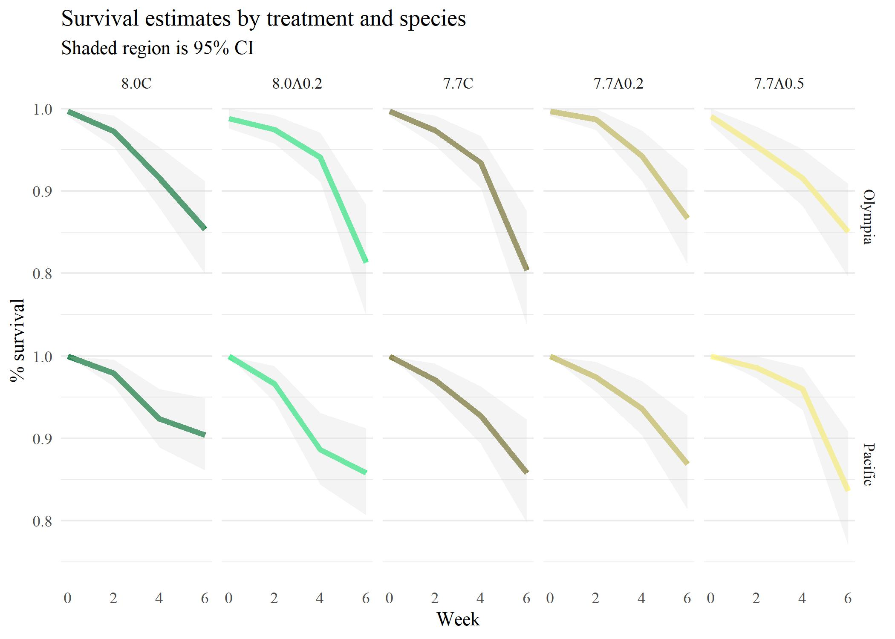

```{r message = F, warning = F, results = 'hide', echo = T}
knitr::opts_chunk$set(echo = TRUE, warning = F, message = F, fig.path = 'figs/')

library(tidyverse)
library(patchwork)
library(ggbeeswarm)
library(psycho)
library(lmerTest)
library(hrbrthemes)
library(kableExtra)
library(shiny)
library(quantreg)
library(janitor)
library(survival)
library(ggfortify)
library(gghalves)
library(modelbased)

data(bymods)
data(wtmods)

trts <- tibble(
  shrtlab = c("8.0C", "8.0A0.2", "7.7C", "7.7A0.2", "7.7A0.5"),
  lngslab = c("8.0 Constant", "8.0 Fluctuating 0.2A", "7.7 Constant", "7.7 Fluctuating 0.2A", "7.7 Fluctuating 0.5A")
)

# consistent response variable terminology names
rsps <- tibble(
  shrtlab = c('size', 'weight'),
  lngslab = c("Final size (cm2)", "Whole weight (g)")
)

# body size, cm2
szdat<- read_csv(here::here('data/raw/finaldata-with-newmissingdata.csv')) %>% 
  clean_names() %>%
  select(week, trt = treatment, jar, id = individual_id, species, final_size = surface_area_cm2_final, initial_size = surface_area_cm2_initial) %>%
  mutate(
    delt_size = final_size - initial_size, 
    init_size = 0,
  ) %>% 
  filter(week != 0) %>% 
  select(week, trt, jar, id, species, delt_size, init_size) %>% 
  gather('var', 'val', delt_size, init_size) %>% 
  separate(var, c('period', 'var')) %>% 
  group_by(week, trt, jar, id, species, period, var) %>% 
  summarise(val = mean(val, na.rm = T)) %>% 
  ungroup %>% 
  filter(!week == 0) %>% 
  mutate(
    week = case_when(
      period == 'init' ~ 0, 
      T ~ week
    )
  ) %>% 
  filter(week != 0)

wtdat <- read.csv(here::here('data/raw/Weight_with dead but not multiple_Kelp_4_3.csv'), stringsAsFactors = F) %>% 
  clean_names() %>% 
  # filter(week != 0) %>% 
  filter(species != '') %>% 
  mutate(
    species = gsub('\\s*$', '', species),
    whole_organism_weight = case_when(
      is.na(whole_organism_weight) &  !is.na(shell_weight) & !is.na(tissue_weight) ~ shell_weight + tissue_weight, 
      T ~ whole_organism_weight
    )
  ) %>% 
  filter(!is.na(initial_wetweight) & !is.na(whole_organism_weight)) %>% 
  select(week, trt = treatment, jar = i_jar, id = individual_id, species, initial_weight = initial_wetweight, 
         final_weight = whole_organism_weight) %>% 
  mutate(
    delt_weight = final_weight - initial_weight, 
    init_weight = 0,
  ) %>% 
  filter(week != 0) %>% 
  select(week, trt, jar, id, species, delt_weight, init_weight) %>% 
  gather('var', 'val', delt_weight, init_weight) %>% 
  separate(var, c('period', 'var')) %>% 
  group_by(week, trt, jar, id, species, period, var) %>% 
  summarise(val = mean(val, na.rm = T)) %>% 
  ungroup %>% 
  filter(!week == 0) %>% 
  mutate(
    week = case_when(
      period == 'init' ~ 0L, 
      T ~ week
    )
  ) %>% 
  filter(week != 0)

# combine size and weight data
allind <- bind_rows(wtdat, szdat) %>% 
  select(-period) %>% 
  mutate(
    trt = factor(trt, levels = trts$shrtlab), 
    var = factor(var, levels = rsps$shrtlab, rsps$lngslab), 
    jar = factor(jar)
  ) %>% 
  mutate(
    direction = sign(val)
  ) %>% 
  filter(direction == 1)

# individual week models
qntplos <- allind %>%  
  filter(species %in% 'Olympia') %>% 
  filter(var == 'Whole weight (g)') %>% 
  filter(week == 6) %>% 
  group_by(species, var, week) %>% 
  nest %>%
  mutate(
    qtmod = purrr::map(data, function(x){
      
      mod <- rq(val ~ trt, tau = 0.8, data = x)     
      mod <- summary(mod)
      return(mod)
      
    }), 
    qtplo = purrr::pmap(list(data, qtmod, var, week, species), function(data, qtmod, var, week, species){
      
      tomod <- data %>% 
        mutate(
          trt = factor(trt, levels = rev(c(trts$shrtlab)), labels = rev(c( 'Intercept (8.0C)', trts$shrtlab[-1])))
        )
    
      tomodqnts <- tomod %>% 
        group_by(trt) %>% 
        summarise(val = quantile(val, 0.8, na.rm = T))
      
      coeffs <- qtmod$coefficients %>% 
        data.frame %>% 
        rownames_to_column('trt') %>% 
        rename(val = coefficients) %>% 
        rowwise() %>% 
        mutate(
          trt = gsub('^trt', '', trt), 
          trt = factor(trt, levels = rev(c('(Intercept)', trts$shrtlab[-1])), labels = rev(c( 'Intercept (8.0C)', trts$shrtlab[-1]))), 
          pval = ifelse(findInterval(0, c(lower.bd, upper.bd)) == 1, 'ns', 'p < 0.05')
          )
      
      p1 <- ggplot(tomod, aes(y = trt, x = val)) + 
        geom_point(position = position_jitter(height = 0.1), alpha = 0.3) +
        geom_point(data = tomodqnts, col = 'cadetblue3', size = 4) + 
        # geom_errorbarh(data = coeffs, aes(xmin = lower.bd, xmax = upper.bd), col = 'red', width = 0.2) + 
        theme_minimal() + 
        theme(
          panel.grid.major.y = element_blank(), 
          panel.grid.minor.y = element_blank(), 
          panel.grid.minor.x = element_blank(), 
          axis.title.y = element_blank()
        ) + 
        labs(
          x = var,
          title = paste(species, '80th percentile model, week', week),
          subtitle = paste0('Observed data and quantile estimate')
        )
      
      p2 <-  ggplot(coeffs, aes(y = trt, x = val)) + 
        geom_point(data = coeffs, aes(col = pval), size = 3) + 
        geom_errorbarh(data = coeffs, aes(xmin = lower.bd, xmax = upper.bd, col = pval), height = 0.2) +
        scale_colour_manual(values = c('black', 'red')) + 
        geom_vline(xintercept = 0, linetype = 'dashed') +
        theme_minimal() + 
        theme(
          panel.grid.major.y = element_blank(), 
          panel.grid.minor.y = element_blank(), 
          panel.grid.minor.x = element_blank(), 
          axis.title.y = element_blank(), 
          legend.title = element_blank()
        ) + 
        labs(
          x = var,
          subtitle = paste0('Quantile estimate and CI bounds')
        )
      
      out <- (p1 + p2 + plot_layout(ncol = 2))
      
      return(out)
      
    })
  )

# week by treatment models
qntwkplos <- allind %>%
  mutate(
    week = factor(week, levels = c('2', '4', '6'))
    ) %>% 
  filter(species %in% 'Pacific') %>% 
  filter(var %in% 'Final size (cm2)') %>% 
  group_by(species, var) %>% 
  nest %>%
  mutate(
    qtmod = purrr::map(data, function(x){

      mod <- rq(val ~ week + trt, tau = 0.8, data = x)
      mod <- summary(mod)
      return(mod)
      
    })
  ) %>% 
  mutate( 
    qtplo = purrr::pmap(list(data, qtmod, var, species), function(data, qtmod, var, species){
      
      coeffs <- qtmod$coefficients %>% 
        data.frame %>% 
        rownames_to_column('trt') %>% 
        rename(val = coefficients) %>% 
        rowwise() %>% 
        mutate(
          trt = gsub('^trt', '', trt), 
          trt = factor(trt,
             levels = c('week6', 'week4', rev(trts$shrtlab[-1]), '(Intercept)'),
             labels = c('week6', 'week4', rev(trts$shrtlab[-1]), 'Intercept (week2, 8.0C)')
             ), 
          pval = ifelse(findInterval(0, c(lower.bd, upper.bd)) == 1, 'ns', 'p < 0.05')
          )

      p <- ggplot(coeffs, aes(y = trt, x = val)) +
        geom_point(aes(col = pval), size = 3) +
        geom_errorbarh(data = coeffs, aes(xmin = lower.bd, xmax = upper.bd, col = pval), height = 0.2) +
        geom_vline(xintercept = 0, linetype = 'dashed') + 
        scale_colour_manual(values = c('black', 'red')) + 
        theme_minimal() +
        theme(
          panel.grid.major.y = element_blank(),
          panel.grid.minor.y = element_blank(),
          panel.grid.minor.x = element_blank(),
          axis.title.y = element_blank(), 
          legend.title = element_blank()
        ) +
        labs(
          x = var,
          title = paste(species, '80th percentile model'),
          subtitle = paste0('Parameter estimates and 95% CI')
        )

      return(p)
      
    })
  )

# dissolution data
dissdat <- read.csv('data/raw/SEM scoring datasheet_MRVERSION.csv') %>% 
  clean_names() %>% 
  filter(week != 0) %>% 
  select(
    jar, 
    id = individual_id, 
    species, 
    week, 
    trt = treatment,
    rep, 
    scr = dissolution_score1
  ) %>% 
  group_by(jar, id, species, week, trt) %>% 
  summarise(
    val = mean(scr, na.rm = T),
    .groups = 'drop'
    ) %>% 
  mutate(
    val = val / 3, 
    jar = factor(jar),
    trt = factor(trt, levels = c("7.7C", "7.7A0.2", "7.7A0.5", "8.0C", "8.0A0.2"))
  )

# treatment colors
cls <- RColorBrewer::brewer.pal(6, 'BrBG')
cls <- c(cls[1:3], cls[c(6, 4)])
names(cls) <- levels(dissdat$trt)

# all comparisons
dissmodsall <- dissdat %>%
  group_by(species) %>% 
  nest %>% 
  mutate(
    mixmod = purrr::map(data, function(x){

      tomod <- x %>% 
        mutate(
          week = factor(week), 
          jar = fct_drop(jar), 
          trt = fct_drop(trt)
        )
      
      out <- lmerTest::lmer(val ~ trt * week + (1|jar), data = tomod)
      
      return(out)
      
    })
  )

```

# Figures {.tabset}

## Growth variability

[download](figs/growthvar.jpg)
```{r, results = 'hide'}
toplo <- allind %>% 
  filter(var %in% c('Final size (cm2)', 'Whole weight (g)')) %>% 
  filter(week == 6) %>% 
  mutate(trt = factor(trt, levels = c( "8.0C", "8.0A0.2", "7.7C", "7.7A0.2", "7.7A0.5")))

cols <- c('seagreen4', 'seagreen2', 'khaki4', 'khaki3', 'khaki1')
names(cols) <- trts$shrtlab

p <- ggplot(toplo, aes(x = trt, y = val, fill = trt)) + 
  geom_half_point_panel(pch = 21, transformation = position_jitter(width = 1, height = 0), alpha = 0.7) + 
  geom_half_violin(colour = 'black') +
  facet_grid(var ~ species, scales = 'free_y', switch = 'y') + 
  scale_fill_manual('Treatment', values = cols, guide = F) +
  theme_minimal() +  
  theme(
    legend.position = 'top', 
    axis.title.y = element_blank(), 
    panel.grid.major.x = element_blank(), 
    panel.grid.minor.x = element_blank(), 
    panel.grid.minor.y = element_blank(), 
    strip.placement = 'outside'
    ) +
  labs(
    x = 'Treatment', 
    title = 'Oyster growth characteristics by treatment', 
    subtitle = 'Observations are for the final week of the experiment'
  )

jpeg('figs/growthvar.jpg', height = 6, width = 6, units = 'in', res = 300, family = 'serif')
print(p)
dev.off()
```

```{r growthvar, fig.cap = "Distribution of oyster growth characteristics in week six arranged by species and treatment.  The left half of values at each treatment show a density histogram and the right half shows measured values for individuals.", out.width = "80%", fig.align = 'center'}
knitr::include_graphics('figs/growthvar.jpg')
```

## CDF curves

[download](figs/cdfcrv.jpg)
```{r, results = 'hide'}
toplo <- allind %>% 
  filter(var %in% c('Final size (cm2)', 'Whole weight (g)')) %>% 
  mutate(trt = factor(trt, levels = c( "8.0C", "8.0A0.2", "7.7C", "7.7A0.2", "7.7A0.5")))

cols <- c('seagreen4', 'seagreen2', 'khaki4', 'khaki3', 'khaki1')
names(cols) <- trts$shrtlab

toplo1 <- toplo %>% 
  filter(species %in% 'Olympia') 
toplo2 <- toplo %>% 
  filter(species %in% 'Pacific')

p1 <- ggplot(toplo1, aes(x = val, colour = trt)) + 
  stat_ecdf(aes(colour = trt), size = 1) +
  facet_grid(week ~ var, scales = 'free', switch = 'x') +
  scale_colour_manual('Treatment', values = cols, guide = F) +
  theme_minimal() +  
  theme(
    legend.position = 'top', 
    axis.title.x = element_blank(), 
    panel.grid.minor.x = element_blank(), 
    panel.grid.minor.y = element_blank(), 
    strip.placement = 'outside', 
    panel.background = element_rect(fill = 'grey95', colour = NA), 
    panel.border = element_blank()
    ) +
  labs(
    x = 'Treatment', 
    y = 'Cumulative frequency', 
    title = 'Cumulative distribution of growth characteristics', 
    subtitle = '(a) Olympia'
  )

p2 <- ggplot(toplo2, aes(x = val, colour = trt)) + 
  stat_ecdf(aes(colour = trt), size = 1) +
  facet_grid(week ~ var, scales = 'free', switch = 'x') +
  scale_colour_manual('Treatment', values = cols) +
  theme_minimal() +  
  theme(
    axis.title.x = element_blank(), 
    panel.grid.minor.x = element_blank(), 
    panel.grid.minor.y = element_blank(), 
    strip.placement = 'outside', 
    panel.background = element_rect(fill = 'grey95', colour = NA), 
    panel.border = element_blank(), 
    # legend.position = 'top', 
    legend.title = element_blank(),
    plot.margin = margin(t=2,1,1,1, "lines"), 
    legend.direction = "horizontal",
    legend.position = c(0.5, 1.15)
    ) +
  labs(
    x = 'Treatment', 
    y = 'Cumulative frequency', 
    subtitle = '(b) Pacific'
  )

p <- p1 + p2 + plot_layout(ncol = 1)

jpeg('figs/cdfcrv.jpg', height = 9, width = 6, units = 'in', res = 300, family = 'serif')
print(p)
dev.off()
```

```{r cdfcrv, fig.cap = "Cumulative distribution curves for growth characteristics (size, whole weight) of (a) Olympia and (b) Pacific oysters by experiment week (row) and treatments (line colors). ", out.width = "70%", fig.align = 'center'}
knitr::include_graphics('figs/cdfcrv.jpg')
```

## Olympia week 4 weight model

[download](figs/week4olympweight.jpg)
```{r, results = 'hide'}
p <- bymods %>% 
  filter(species == 'Olympia') %>% 
  filter(var == 'Whole weight (g)') %>% 
  filter(week == 4) %>% 
  pull(plomod)

jpeg('figs/week4olympweight.jpg', height = 5, width = 8, units = 'in', res = 300, family = 'serif')
print(p)
dev.off()
```

```{r week4olympweight, fig.cap = "Mean weight estimates and differences between treatments for Olympia oysters in week four.  Results show estimatde means for each treatment (left) and treament differences as model contrasts (right).  Contrasts that show significant differences between treatments in the right plot are in red.", out.width = "80%", fig.align = 'center'}
knitr::include_graphics('figs/week4olympweight.jpg')
```

## Pacific week 2 weight model

[download](figs/week2pacifweight.jpg)
```{r, results = 'hide'}
p <- bymods %>% 
  filter(species == 'Pacific') %>% 
  filter(var == 'Whole weight (g)') %>% 
  filter(week == 2) %>% 
  pull(plomod)

jpeg('figs/week2pacifweight.jpg', height = 5, width = 8, units = 'in', res = 300, family = 'serif')
print(p)
dev.off()
```

```{r week2pacifweight, fig.cap = "Mean weight estimates and differences between treatments for Pacific oysters in week two.  Results show estimated means for each treatment (left) and treament differences as model contrasts (right).  Contrasts that show significant differences between treatments in the right plot are in red.", out.width = "80%", fig.align = 'center'}
knitr::include_graphics('figs/week2pacifweight.jpg')
```

## Pacific size rate, treatment by week

[download](figs/pacifsizerate.jpg)
```{r, results = 'hide'}
p <- wtmods %>% 
  filter(species == 'Pacific') %>% 
  filter(var == 'Size rate (cm2/d)') %>% 
  pull(plomod) %>% 
  .[[1]] + 
  theme(panel.grid.major.y = element_line())

jpeg('figs/pacifsizerate.jpg', height = 5, width = 6, units = 'in', res = 300, family = 'serif')
print(p)
dev.off()
```

```{r pacifsizerate, fig.cap = "Mean estimates of growth rates (cm2/d) of Pacific oysters across all weeks and treatments. Estimates are from a mixed-effects model with week and treatment as predictors.  Week had a significant negative relationship with growth rate (df = 2, F = 10.16, p < 0.005).", out.width = "80%", fig.align = 'center'}
knitr::include_graphics('figs/pacifsizerate.jpg')
```

## Olympia week six, quantile weight model

[download](figs/olympqntmod.jpg)
```{r, results = 'hide'}
p <- qntplos %>% 
  pull(qtplo) %>% 
  .[[1]]

jpeg('figs/olympqntmod.jpg', height = 3, width = 8, units = 'in', res = 300, family = 'serif')
print(p)
dev.off()
```

```{r olympqntmod, fig.cap = "Estimates of the 80th percentile of whole weight (g) by treatment for Olympia oyster in week 6.  The left plot shows observed values with the 80th percentile value for ecah treatment (blue points) and the right plot shows estimates from quantile regression models.  Estimates in the right plot are relative to model intercept set as the 8.0 pH control treatment.  Point estimates and confidence intervals in the right plot that are significantly different than zero are in red.  The quantile regression model is based on individuals showing only positive growth throughout the experiment.", out.width = "90%", fig.align = 'center'}
knitr::include_graphics('figs/olympqntmod.jpg')
```

## Pacfice, quantile size model

[download](figs/pacifqntmod.jpg)
```{r, results = 'hide'}
p <- qntwkplos %>% 
  pull(qtplo) %>% 
  .[[1]]

jpeg('figs/pacifqntmod.jpg', height = 3, width = 6, units = 'in', res = 300, family = 'serif')
print(p)
dev.off()
```

```{r pacifqntmod, fig.cap = "Estimates of the 80th percentile of individual sizes (cm2) by treatment and week for Olympia oyster.  Estimates are the 80th percentile conditional value from a quantile regression model of oyster size with week and treatment as predictors.  The estimates and confidence intervals are relative to the model intercept set as the 8.0 pH control treatment and week two.  Estimates that are significantly different than zero are in red.  The quantile regression model is based on individuals showing only positive growth throughout the experiment.", out.width = "70%", fig.align = 'center'}
knitr::include_graphics('figs/pacifqntmod.jpg')
```

## Survival estimates, between treatments

[download](figs/survivaltreat.jpg)
```{r, results = 'hide'}
srvraw <- read.csv(here::here('data/raw/Weight_with dead but not multiple_Kelp_4_3.csv'), stringsAsFactors = F) %>% 
  clean_names() %>% 
  filter(species != '') %>% 
  mutate(species = gsub('\\s*$', '', species)) %>% 
  rename(
    id = individual_id, 
    jar = i_jar,
    trt = treatment
  ) %>% 
  select(week, trt, jar, id, species, dead) %>% 
  mutate(
    dead = case_when(
      dead %in% c('x', 'X') ~ 1, 
      T ~ 0
    ), 
    trt = factor(trt, levels = trts$shrtlab)
  )
  
srvdat <- srvraw %>% 
  group_by(species) %>%
  nest %>% 
  mutate(
    srvmod = purrr::map(data, function(x){
      browser()
      fit <- survfit(Surv(week, dead) ~ trt, data = x)
      return(fit)
      
    }), 
    srvdif = purrr::map(data, function(x){
    
      fit <- survdiff(Surv(week, dead) ~ trt, data = x)
      return(fit)
      
    })
  )

srvplos <- srvdat %>% 
  mutate(
    plodat = purrr::map(srvmod, fortify)
  ) %>% 
  select(-data, -srvmod, -srvdif) %>% 
  unnest(plodat)

cols <- c('seagreen4', 'seagreen2', 'khaki4', 'khaki3', 'khaki1')
names(cols) <- trts$shrtlab

p <- ggplot(srvplos, aes(x = time, y = surv)) + 
  geom_line(aes(colour = strata), size = 1.5) + 
  geom_ribbon(aes(ymin = lower, ymax = upper), colour = NA, fill = 'lightgrey', alpha = 0.25) +
  facet_grid(species ~ strata) +
  scale_colour_manual('Treatment', values = cols, guide = F) +
  theme_minimal() +
  theme(
    panel.grid.major.x = element_blank(), 
    panel.grid.minor.x = element_blank(), 
    legend.position = 'top'
  ) + 
  labs(
    x = 'Week', 
    y = '% survival', 
    title = 'Survival estimates by treatment and species',
    subtitle = 'Shaded region is 95% CI'
  )

jpeg('figs/survivaltreat.jpg', height = 5, width = 7, units = 'in', res = 300, family = 'serif')
p
dev.off()
```

```{r survivaltreat, fig.cap = "Survival estimates of oysters by species and treatment from the beginning to end of the six week exposure period.  Values are the approximate percentage of individuals surviving at each time step and are based on Kaplan-Meier estimates for right-censored data.", out.width = "70%", fig.align = 'center'}

```

## Survival estimates, between species

[download](figs/survivalspecies.jpg)
```{r, results = 'hide'}
srvmod <- survfit(Surv(week, dead) ~ species, data = srvraw)

srvplos <- fortify(srvmod)

p <- ggplot(srvplos, aes(x = time, y = surv)) + 
  geom_line(aes(colour = strata), size = 1.5) + 
  geom_ribbon(aes(ymin = lower, ymax = upper), colour = NA, fill = 'lightgrey', alpha = 0.25) +
  facet_grid( ~ strata) +
  theme_minimal() +
  theme(
    panel.grid.major.x = element_blank(), 
    panel.grid.minor.x = element_blank(), 
    legend.position = 'none'
  ) + 
  labs(
    x = 'Week', 
    y = '% survival', 
    title = 'Survival estimates by species, across treatments',
    subtitle = 'Shaded region is 95% CI'
  )

jpeg('figs/survivalspecies.jpg', height = 3, width = 4, units = 'in', res = 300, family = 'serif')
p
dev.off()
```

```{r survivalspecies, fig.cap = "Survival estimates of oysters by species from the beginning to end of the six week exposure period.  All treatments are aggregated across species and weeks.  Values are the approximate percentage of individuals surviving at each time step and are based on Kaplan-Meier estimates for right-censored data.", out.width = "50%", fig.align = 'center'}
knitr::include_graphics('figs/survivalspecies.jpg')
```

## Dissolution models

[download](figs/dissmod.jpg)
```{r, results = 'hide'}

# sample size
pacn <- dissmodsall %>% filter(species == 'Pacific') %>% pull(mixmod) %>% .[[1]] %>% .@frame %>% nrow
olyn <- dissmodsall %>% filter(species == 'Olympia') %>% pull(mixmod) %>% .[[1]] %>% .@frame %>% nrow
captns <- paste0('n = ', pacn , ' (Pacific), ', olyn, ' (Olympia)')

# Pacific estimates
mnsval <- dissmodsall %>% 
  select(species, mixmod) %>% 
  mutate(
    mixmod = purrr::map(mixmod, estimate_means)
    ) %>% 
  unnest('mixmod') %>% 
  mutate(
    species = factor(species, levels = c('Pacific', 'Olympia'), labels = c('(a) Pacific oyster', '(b) Olympia oyster'))
  )

# mean esimate plots
p <- ggplot(mnsval, aes(x = week, y = Mean, group = trt, colour = trt, fill = trt)) + 
  geom_errorbar(aes(ymin = CI_low, ymax = CI_high, colour = trt), width = 0, position = position_dodge(0.3), size = 1) + 
  geom_line(position = position_dodge(0.3)) + 
  geom_point(size = 3, position = position_dodge(0.3), pch = 21, colour = 'black') + 
  labs(x = 'Exposure week', y = 'Mean dissolution (+/- 95% CI)', caption = captns) + 
  facet_wrap(~species, ncol = 2) +
  scale_colour_manual(values = cls) + 
  scale_fill_manual(values = cls) + 
  theme_minimal() + 
  theme(
    panel.grid.major = element_blank(),
    panel.grid.minor = element_blank(), 
    legend.title = element_blank(), 
    strip.text = element_text(hjust = 0, size = 12), 
    plot.caption = element_text(face = 'italic')
  )

jpeg('figs/dissmod.jpg', height = 4, width = 7, units = 'in', res = 300, family = 'serif')
p
dev.off()
```
```{r dissmod, fig.cap = "Model estimates of mean dissolution (+/- 95% confidence intervals) for each species, treatment and week of experimental exposure.  Estimate are based on two-way analysis of variance models with an interaction between week and treatment, using jar as a random effect.  Confidence intervals that do not include zero have statistically significant dissolution and treatments/weeks that have non-overlapping confidence intervals can be considered statistically different.  Dissolution is expressed as a relative total from 0-1 based on descriptions in the methods.", out.width = "90%", fig.align = 'center'}

```
